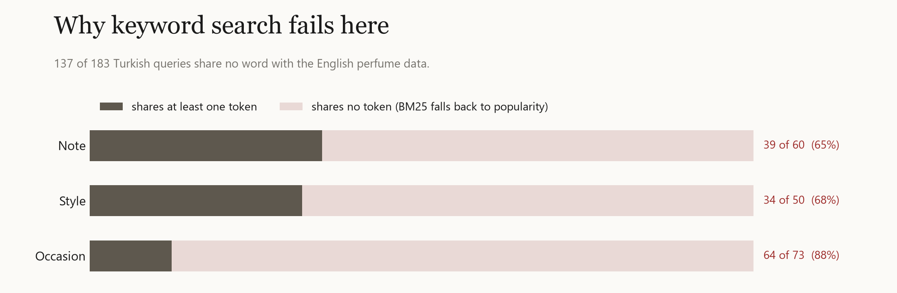

# koku

Turkish fragrance assistant: distilled small LM, fine-tuned retriever, in-browser demo.

## Data

Fragrantica.com Fragrance Dataset (Kaggle, olgagmiufana1, v3, 2024-09-21), CC BY-NC-SA 4.0. Non-commercial; derived models and data are shared under the same license.

## Setup

`uv sync` installs pinned dependencies (CUDA 12.4 PyTorch). Scripts without third-party imports also run with plain `python`.

## Pipeline

| Step | Script | Output |
|---|---|---|
| Download | `uv run --with kaggle kaggle datasets download olgagmiufana1/fragrantica-com-fragrance-dataset -p data --unzip` | `data/fra_cleaned.csv` |
| Profile | `uv run --with pandas python profile_data.py` | stdout |
| Clean | `uv run --with pandas python clean.py` | `data/perfumes.jsonl` (24,063 perfumes) |
| BM25 baseline | `python retrieve/bm25.py` | `runs/bm25.jsonl` |
| Retriever fine-tune | `uv run python retrieve/finetune.py` | `models/bge-m3-koku` |
| Dense baselines | `uv run python retrieve/dense.py [--docs en\|tr\|desc]` | `runs/dense-*.jsonl` |
| Teacher data | `uv run python distill/generate.py` (needs local llama-server, see script) | `data/teacher.jsonl` |
| Teacher QA | `uv run python distill/check.py --write` | `data/teacher.clean.jsonl` |
| Charts | `uv run python eval/plot.py` | `assets/*.png` |

`fra_cleaned.csv` is `;`-separated, decimal comma, cp1252-encoded (`0x99` = ™, `0x92` = ’). Cleaning lowercases notes, strips ®/™, dedupes notes per tier, and title-cases name/brand slugs.

## Evaluation set

`eval/queries.jsonl` holds 183 Turkish search queries of three types: `note` (60, names a note or accord), `style` (50, describes a scent family or character) and `occasion` (73, only the situation or feeling, e.g. "ilk buluşmada çekici ama abartısız bir koku"). The retriever sees only the `query` text. Each query carries machine-checkable constraints (accords, notes, gender) instead of hand-picked answers, so relevance is reproducible and auditable:

```bash
python eval/label.py      # constraints -> eval/qrels.jsonl + eval/review.md (human review sheet)
python eval/evaluate.py --baseline        # popularity baseline
python eval/evaluate.py runs/<run>.jsonl  # any retriever
```

Corpus: 13,718 perfumes with at least 100 votes. Relevant perfumes per query: min 5, median 247, max 791.
Metrics at k=10: precision, nDCG, MRR. Recall is not reported because most queries have far more than 10 relevant perfumes.


nDCG@10 per query type (`uv run python eval/evaluate.py runs/<run>.jsonl` prints P@10 and MRR@10 too):

| Run | all | note | style | occasion |
|---|---|---|---|---|
| Popularity (same top-voted list for every query) | 0.013 | 0.014 | 0.018 | 0.009 |
| BM25 on raw Turkish query (`retrieve/bm25.py`) | 0.048 | 0.092 | 0.052 | 0.009 |
| multilingual-e5-small, zero-shot (`retrieve/dense.py`) | 0.121 | 0.157 | 0.177 | 0.053 |
| multilingual-e5-base, zero-shot | 0.145 | 0.168 | 0.229 | 0.070 |
| BGE-M3, zero-shot | 0.180 | 0.189 | 0.303 | 0.089 |
| multilingual-e5-base, Turkish docs (`--docs tr`) | 0.322 | 0.467 | 0.411 | 0.142 |
| BGE-M3, Turkish docs (`--docs tr`) | 0.359 | 0.532 | 0.494 | 0.125 |
| multilingual-e5-base, + teacher description (`--docs desc`) | 0.374 | 0.610 | 0.476 | 0.110 |
| BGE-M3, + teacher description (`--docs desc`) | 0.426 | 0.642 | 0.550 | 0.165 |
| BGE-M3 fine-tuned on teacher pairs, + description (`retrieve/finetune.py`) | **0.477** | **0.749** | **0.609** | 0.164 |



BM25 only helps where a Turkish query shares a token with the English perfume text (e.g. "bergamot", "iris", "neroli"): 137 of 183 queries share none and fall back to the popularity ranking. Off-the-shelf multilingual embedders close the language gap (BGE-M3 is 3.8x BM25 overall), but occasion queries stay weakest: mapping "fireplace" or "first date" to accords is what a fine-tuned retriever has to learn.

### Document expansion

Two cheap changes to the perfume side, with no model training:

- `--docs tr`: notes and accords mapped to Turkish with a fixed table (`distill/tr_names.json`, 300 most frequent notes + all accords). BGE-M3 doubles (0.180 to 0.359); note queries go from 0.189 to 0.532. Cross-lingual matching was the main loss, not model capacity.
- `--docs desc`: the Turkish fields plus a 2-3 sentence Turkish description written by the local teacher (Qwen3-8B, `distill/generate.py`). Another +19% overall (0.426), and the best occasion score so far (0.165), because descriptions name seasons and settings that raw accords never mention.

Occasion queries are still far behind note and style queries.

### Retriever fine-tuning

`retrieve/finetune.py` fine-tunes BGE-M3 on 37,677 (Turkish query, perfume) pairs written by the teacher (three queries per perfume), with InfoNCE over in-batch negatives. The eval set is never read during training; 5% of perfumes are held out for validation. One epoch on an RTX 4060 (8 GB): top 12 of 24 layers trainable, bf16, gradient checkpointing, ~19 minutes.

- Held-out teacher queries, recall@10: 0.116 before, 0.305 after.
- Eval set, nDCG@10: 0.426 to 0.477 overall; note 0.642 to 0.749, style 0.550 to 0.609.
- Occasion queries do not move (0.165 to 0.164). The teacher's occasion queries are repetitive ("kış günü..."), so the model learns little new about situations. Better occasion training data is the next lever, not more epochs.

Charts: `uv run python eval/plot.py`.

Known limits: occasion queries map feelings to accords by judgement (e.g. "fireplace" means smoky + amber/woody/balsamic), so they are the least objective part of the set; queries were drafted with an LLM and are pending human review (`eval/review.md`); constraints only see the top-5 accords and listed notes, so a correct but unlisted perfume counts as a miss.
