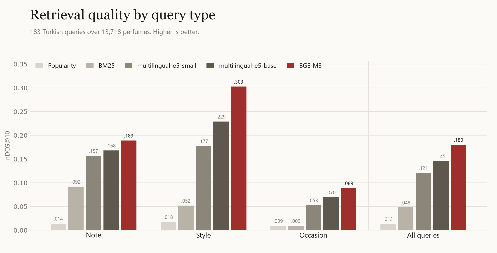

# koku

Türkçe parfüm asistanı: yerel bir öğretmen modelden damıtılmış küçük bir dil modeli, ince ayarlı bir arama modeli (retriever) ve tarayıcıda çalışan bir demo.

**Canlı demo:** [demirciberk.com/demo/koku](https://demirciberk.com/demo/koku/). 183 Türkçe değerlendirme sorgusunun tamamı; hazır model ile son sistem yan yana, her parfümün altında 0.6B öğrenci modelin yazdığı Türkçe tanım.

English: [README.md](README.md)

## Özet

| Adım | Sonuç |
|---|---|
| Veri | Fragrantica (Kaggle), 24.063 parfüm; 100+ oylu 13.718 parfüm arama havuzu |
| Değerlendirme seti | 183 Türkçe sorgu (nota, tarz, ortam), etiketler makinece kontrol edilebilir kısıtlardan |
| Öğretmen | Qwen3-8B (Q4_K_M, llama.cpp), RTX 4060 üzerinde 6,4 saatte 13.718 parfüm için Türkçe tanım + 3 sorgu |
| Arama | nDCG@10: BM25 0,048, hazır BGE-M3 0,180, Türkçe belge 0,359, + öğretmen tanımı 0,426, ince ayar sonrası **0,477** |
| Öğrenci | Qwen3-0.6B + LoRA: geçerli JSON %0'dan %100'e, uydurma nota oranı %2 (öğretmen %10,5) |
| Sıkıştırma | Q8_0 kayıpsız (639 MB); Q4_K_M %4 F1 kaybıyla 397 MB, tek akışta 137 token/sn |

## Ne öğrendim

- **En büyük kazanç modelden değil veriden geldi.** Sadece nota ve akor adlarını sabit bir tabloyla Türkçeye çevirmek BGE-M3'ün skorunu ikiye katladı (0,180'den 0,359'a). Kayıp, modelin kapasitesinde değil, sorgu ile belgenin farklı dillerde olmasındaydı.
- **Belge genişletme ucuz ve etkili.** Öğretmenin yazdığı 2-3 cümlelik tanımlar mevsim ve ortam bilgisi ekledi; skor %19 daha arttı.
- **İnce ayar nota ve tarz sorgularını iyileştirdi, ortam sorgularını iyileştirmedi** (0,165'ten 0,164'e). Öğretmenin ortam sorguları tekrarlıydı ("kış günü evde..."), model yeni bir şey öğrenemedi. Sıradaki adım daha çeşitli ortam verisi.
- **Damıtma formatı ve sadakati öğretiyor.** Eğitimsiz 0.6B hiç geçerli JSON üretemedi. Eğitimden sonra her seferinde doğru formatta cevap veriyor ve öğretmenden daha az nota uyduruyor, çünkü girdideki nota listesine daha sıkı bağlı kalmayı öğrendi.
- **0.6B'de Q4 ile Q8 aynı hızda.** Bu boyutta ağırlıkları küçültmek hızı artırmıyor; Q8 kalite kaybı olmadan en iyi denge.

## Yöntem

1. **Temizleme** (`clean.py`): cp1252 kodlama, ®/™ temizliği, nota tekilleştirme.
2. **Değerlendirme** (`eval/`): her sorgunun akor, nota ve cinsiyet kısıtları var. Arama modeli yalnızca sorgu metnini görüyor; kısıtlar sadece cevap anahtarı. Bunu bir test denetliyor.
3. **Öğretmen verisi** (`distill/generate.py`): her parfüm için Türkçe tanım ve üç sorgu. Model nota adlarını yanlış çevirdiği için ("peony" yerine "pony") 300 notalık bir çeviri tablosu kullanıldı. Ortam sorguları altı farklı açıdan üretildi. `distill/check.py` İngilizce kelime, marka sızıntısı ve ortam sorgusunda nota adı geçen satırları ayıklıyor: 13.718 satırdan 13.220'si kaldı.
4. **Arama modeli ince ayarı** (`retrieve/finetune.py`): öğretmenin 37.677 (sorgu, parfüm) çifti, batch içi negatiflerle InfoNCE. Değerlendirme seti eğitimde hiç okunmuyor, parfümlerin %5'i ayrı tutuluyor.
5. **Öğrenci** (`distill/sft.py`): Qwen3-0.6B, LoRA (r=16), yalnızca cevap token'larında kayıp, 12.559 parfüm, bir epoch.
6. **Sıkıştırma** (`distill/export.py`, `distill/bench.py`): LoRA birleştirme, GGUF dönüşümü, Q8_0 ve Q4_K_M; llama-server ile 200 ayrı tutulmuş parfümde ölçüm.
7. **Demo** (`demo/build.py`): tüm sonuçlar önceden hesaplanıyor; sayfa hiçbir model çalıştırmıyor.

Komutlar ve tüm sayılar İngilizce README'de.

## Sınırlar

- Değerlendirme sorguları bir LLM ile taslaklandı ve henüz insan incelemesinden geçmedi (`eval/review.md`).
- Ortam sorgularının etiketi yoruma dayalı (ör. "şömine başı" = dumanlı + amber/odunsu), setin en az nesnel kısmı bu.
- Kısıtlar yalnızca ilk 5 akoru ve listelenen notaları görüyor; doğru ama listede olmayan bir parfüm hata sayılıyor.
- Uydurma nota ölçüsü yalnızca çeviri tablosundaki notaları kontrol ediyor.
- Öğretmen verisi tekrarlı; öğrenci de bu tekrarı devralıyor.

## Lisans

Veri: Fragrantica.com Fragrance Dataset (Kaggle, olgagmiufana1), CC BY-NC-SA 4.0. Ticari olmayan kullanım; türetilmiş modeller ve veriler aynı lisansla paylaşılır.
